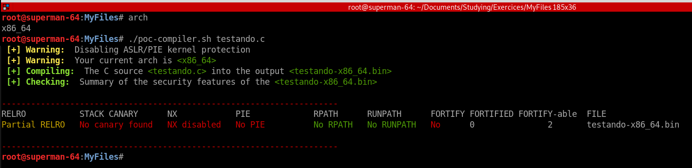
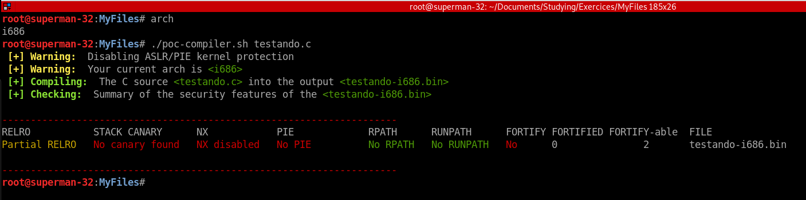
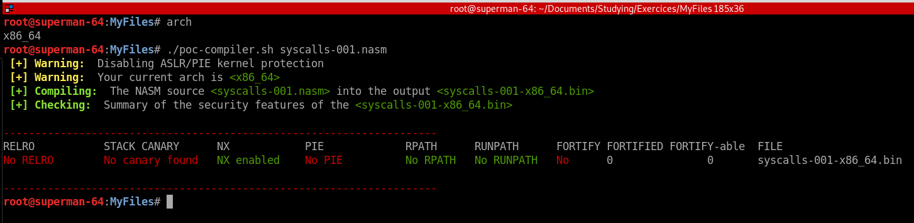

# poc-compiler
Simple Bash Script to compile the PoC files in C or Assembly (nasm) without any protection

## Requirements
On Debian Linux based:
```
sudo apt-get update
sudo apt-get install ld gcc nasm
```

## Usage

### C files must have **".c"** extension
```
./poc-compiler.sh filename.c
```

### Assembly files must have **".nasm"** extension
```
./poc-compilher.sh filename.nasm
```
### Screenshots

Compiling C source files on Linux x86_64 (64bit) machine:
<a href="pics/Screenshot_1.png"></a>

Compiling C source files on Linux i686 (32bit) machine:
<a href="pics/Screenshot_2.png"></a>

Compiling Assembly (nasm) source file on Linux i686 (32bit) machine:
<a href="pics/Screenshot_3.png"></a>